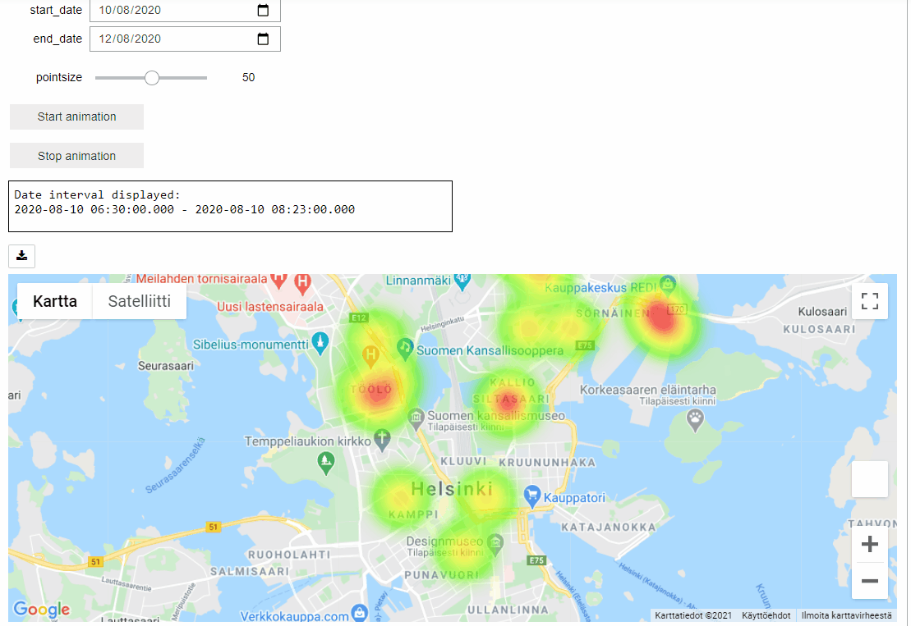
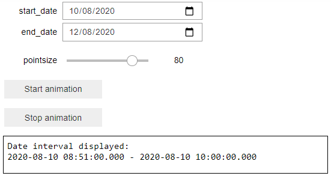
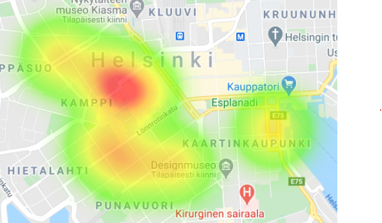
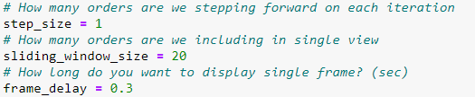

# Data Science Summer Intern assignment 2021 Sormunen Teemu

# Project overview
## The problem

First choice every Wolt courier has to make in the new day, is to choose the area he decides to operate within. Every courier wants to maximize their efficiency, and Wolt most likely also wants to maximize the efficiency of its couriers. It can be hard to predict where and when the courier should be to maximize the daily amount of deliveries.

## The solution

This project provides small proof-of-concept for monitoring the amount of orders during the day. In this project, customizable heatmap is made to indicate in which areas the restaurants are busy. This type of solution provides historical information about deliveries which can then be applied to predict amount of orders on hourly, daily, or even monthly level is enough data is provided. 

User is able to choose the interval between which to investigate the heatmap distribution via small interface as seen below.

Single companies shouldn't be identifiable from this map due to data privancy conserns. The heatmap can be made more general by increasing the pointsize, making the individual datapoints to vanish as can be seen below

The tool also allows user to get broader overview of the data, by choosing to start animation. Before starting the animation, user configure the animation parameters. In these parameters *step_size* defines how many samples do we want to jump forward after each iteration, and *sliding_window_size* defines how large portion of the data we want to visualized during each iteration. These parameters can also be seen below.

Here's one more example of interacting with the user interface.

## Future work

This work can be extended to provide better predictive capabilities. Bayesian principles could be used to predict the amount of orders that are places for each company separately. This approach provides us with nicely interpretable probabilistic distributions for predicting the amount of orders placed. In the future Wolt-couriers might be able to have some kind of indication within the app where orders are most likely placed. 

# Running the project

To run the project you must create generate Google Map's Javascript API key. This key then has to be inserted either to file called *apikey.txt*, or then user can edit the wolt_data_analysis.ipynb and set the API key directly there.

Dependencies can be installed with
`pip install -r requirements.txt`

Project must be run with Jupyter Notebook.
